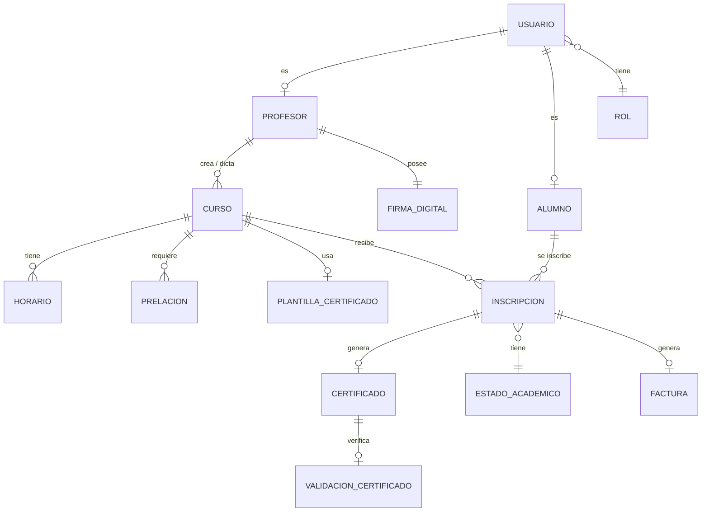

# Arquitectura del Sistema de Certificaciones Académicas — Hidalgo Academy

---

# FASE A — ANÁLISIS DEL SISTEMA

## 1. Resumen del sistema

El **Sistema de Certificaciones Académicas** es una plataforma web que gestiona el ciclo completo de formación académica: desde la creación de cursos por profesores, la inscripción de estudiantes, el seguimiento de estados académicos (inscrito, oyente, aprobado, reprobado), hasta la emisión de certificados digitales con QR verificable. El sistema opera con tres roles (Administrador, Profesor, Alumno) y contempla prelaciones entre cursos, control de horarios sin solapamiento, carga masiva de usuarios/cursos, generación de facturas y reportes.

## 2. Entidades principales del negocio

| # | Entidad | Descripción |
|---|---------|-------------|
| 1 | **Usuario** | Persona registrada en el sistema (base común para admin, profesor, alumno) |
| 2 | **Rol** | Tipo de acceso: administrador, profesor, alumno |
| 3 | **Profesor** | Extensión de usuario con datos específicos: firma digital, especialidad |
| 4 | **Alumno** | Extensión de usuario con datos específicos: cédula, historial académico |
| 5 | **Curso** | Unidad de formación con temario, duración, tope de estudiantes |
| 6 | **Horario** | Días y franjas horarias asignadas a un curso |
| 7 | **Prelación** | Relación de dependencia entre cursos |
| 8 | **Inscripción** | Relación alumno ↔ curso con estado académico |
| 9 | **Estado Académico** | Catálogo: inscrito, aun_no_empieza, oyente, aprobado, reprobado |
| 10 | **Certificado** | Documento digital generado al aprobar un curso |
| 11 | **Plantilla Certificado** | Imagen base + configuración del diseño del certificado |
| 12 | **Firma Digital** | Imagen de firma del profesor para el certificado |
| 13 | **Factura** | Registro económico de inscripción o certificación (futuro) |
| 14 | **Reporte** | Datos agregados para dashboards y estadísticas (futuro) |

## 3. Relaciones importantes entre entidades



**Relaciones clave:**

| Relación | Tipo | Explicación |
|----------|------|-------------|
| Usuario → Rol | N:1 | Cada usuario tiene un rol. Un rol agrupa muchos usuarios |
| Usuario → Profesor / Alumno | 1:1 | Herencia: datos específicos según rol |
| Profesor → Curso | 1:N | Un profesor crea y dicta muchos cursos |
| Curso → Horario | 1:N | Un curso tiene múltiples bloques horarios |
| Curso → Prelación | N:N | Un curso puede requerir y ser requisito de otros |
| Alumno ↔ Curso (Inscripción) | N:N | Tabla pivote con estado académico |
| Inscripción → Certificado | 1:1 (condicional) | Solo si `estado = aprobado` |
| Curso → Plantilla Certificado | N:1 | Varios cursos pueden usar la misma plantilla |
| Profesor → Firma Digital | 1:1 | Cada profesor sube su firma única |

## 4. ¿Qué se debe migrar de LocalStorage a backend?

Tras analizar tu código actual, estas son las piezas que **hoy usan LocalStorage** y deben migrar:

| Componente actual | Clave LS | Migración requerida |
|-------------------|----------|---------------------|
| [autenticacionStore_ahbb.ts](file:///c:/Users/alang/Downloads/Pro_Ronald/Programaci%C3%B3nVII/ProVII_Proyecto/src/stores/autenticacionStore_ahbb.ts) → lista de usuarios | `certificaciones_usuarios_ahbb` | **Tabla `usuarios_ahbb`** en BD + endpoint de auth con JWT |
| [autenticacionStore_ahbb.ts](file:///c:/Users/alang/Downloads/Pro_Ronald/Programaci%C3%B3nVII/ProVII_Proyecto/src/stores/autenticacionStore_ahbb.ts) → sesión activa | `certificaciones_sesion_ahbb` | **Token JWT** almacenado en cookie httpOnly o header |
| [cursosStore_ahbb.ts](file:///c:/Users/alang/Downloads/Pro_Ronald/Programaci%C3%B3nVII/ProVII_Proyecto/src/stores/cursosStore_ahbb.ts) → lista de cursos | `certificaciones_cursos_ahbb` | **Tabla `cursos_ahbb`** en BD + endpoints CRUD |
| [router/index.ts](file:///c:/Users/alang/Downloads/Pro_Ronald/Programaci%C3%B3nVII/ProVII_Proyecto/src/router/index.ts) → verificación de sesión | Lectura directa de LS | **Guard con verificación de token JWT** |
| [helpers/almacenamiento_ahbb.ts](file:///c:/Users/alang/Downloads/Pro_Ronald/Programaci%C3%B3nVII/ProVII_Proyecto/src/helpers/almacenamiento_ahbb.ts) → funciones genéricas | N/A | **Reemplazar por servicios API** (`src/servicios/`) |

> [!IMPORTANT]
> **No debes destruir** el helper [almacenamiento_ahbb.ts](file:///c:/Users/alang/Downloads/Pro_Ronald/Programaci%C3%B3nVII/ProVII_Proyecto/src/helpers/almacenamiento_ahbb.ts) de inmediato. La estrategia correcta es crear una **capa de servicios API** y que los stores cambien gradualmente de llamar [obtenerDato_ahbb()](file:///c:/Users/alang/Downloads/Pro_Ronald/Programaci%C3%B3nVII/ProVII_Proyecto/src/helpers/almacenamiento_ahbb.ts#8-27) a llamar `servicioApi_ahbb.obtenerCursos()`. El helper puede seguir funcionando como fallback durante la transición.

## 5. Problemas de diseño si no se estructura bien la BD

| # | Problema | Consecuencia | Solución |
|---|----------|--------------|----------|
| 1 | **Rol fijo en usuario** (`administrador \| profesor`) | No hay soporte para alumno; no es extensible | Tabla `roles_ahbb` separada con FK |
| 2 | **Profesor como string** en curso | No hay integridad referencial, no se puede filtrar por profesor | FK `profesor_id` a tabla `profesores_ahbb` |
| 3 | **Sin tabla de inscripciones** | No se puede rastrear quién está inscrito, estados académicos, historial | Tabla `inscripciones_ahbb` con estado |
| 4 | **Sin tabla de horarios** | Días como array en JSON sin validación de solapamiento | Tabla `horarios_ahbb` normalizada |
| 5 | **Sin control de prelaciones** | Solo un campo `prelacionCursoId` no soporta prelaciones múltiples | Tabla `prelaciones_ahbb` separada |
| 6 | **Contraseñas en texto plano** | Vulnerabilidad crítica de seguridad | Hash con bcrypt en backend |
| 7 | **Sin timestamps de auditoría** | Solo `fechaCreacion`, sin `fechaActualizacion` ni control de cambios | Agregar `creado_en`, `actualizado_en` a todas las tablas |
| 8 | **Sin cédula/documento** para el alumno | El certificado y QR necesitan identificar al alumno por cédula | Campo `cedula_ahbb` en perfil de alumno |

## 6. Requerimientos implícitos detectados

| # | Requerimiento implícito | Justificación |
|---|------------------------|---------------|
| 1 | **Tabla de períodos académicos** | Los cursos deben agruparse por semestre/trimestre para organizar oferta |
| 2 | **Historial de inscripciones** | Un alumno que reprueba debe poder reinscribirse → necesita versionar inscripciones |
| 3 | **Estado del curso** (programado, en_curso, finalizado, cancelado) | Distinto al estado del alumno. El curso tiene su propio ciclo de vida |
| 4 | **Fechas de inicio y fin del curso** | Falta en el modelo actual. Necesario para controlar cuándo comienza y termina |
| 5 | **Auditoría de acciones** | Quién creó, editó, eliminó qué y cuándo. Importante para sistema académico |
| 6 | **Recuperación de contraseña** | Si se envían credenciales por correo, debe existir mecanismo de reset |
| 7 | **Estado del usuario** (activo, inactivo, bloqueado) | Para deshabilitar cuentas sin eliminar datos |
| 8 | **Validación de solapamiento de horarios** | Regla de negocio crítica: no puede haber dos cursos del mismo profesor en la misma franja |
| 9 | **Categorías / áreas temáticas** | Para organizar cursos por tema y facilitar búsquedas |
| 10 | **Configuración general del sistema** | Tabla para parámetros: nombre de la institución, logo, correo remitente, etc. |

---

# FASE B — ROLES Y MENÚS DEL SISTEMA

## Rol: Administrador

| Capacidad | Detalle |
|-----------|---------|
| **Ver** | Dashboard general, todos los usuarios, todos los cursos, inscripciones, certificados, reportes, facturación |
| **Crear** | Usuarios (masivo y manual), cursos (masivo), roles, períodos académicos |
| **Editar** | Cualquier usuario, curso, inscripción, configuración general |
| **Bloquear** | Imágenes de certificado subidas por profesores, cuentas de usuario |
| **Eliminar** | Usuarios, cursos (soft delete recomendado) |

**Menú del Administrador:**
```
📊 Dashboard
👥 Usuarios
   ├── Lista de profesores
   ├── Lista de alumnos
   ├── Carga masiva
   └── Gestión de roles
📚 Cursos
   ├── Todos los cursos
   ├── Carga masiva de cursos
   └── Horarios
📝 Inscripciones
   ├── Todas las inscripciones
   └── Estados académicos
🏅 Certificados
   ├── Certificados emitidos
   ├── Plantillas
   └── Configuración de imágenes
💰 Facturación (futuro)
📈 Reportes (futuro)
⚙️ Configuración
   ├── Datos de la institución
   ├── Parámetros del sistema
   └── Correo electrónico
```

## Rol: Profesor

| Capacidad | Detalle |
|-----------|---------|
| **Ver** | Dashboard propio, sus cursos, alumnos inscritos en sus cursos, certificados de sus cursos |
| **Crear** | Cursos propios, alumnos manualmente, contenido/temario |
| **Editar** | Sus cursos, su perfil, su firma digital, plantilla de certificado de sus cursos |
| **Restricciones** | No puede ver cursos de otros profesores, no puede gestionar usuarios globales, no puede acceder a facturación ni reportes generales |

**Menú del Profesor:**
```
📊 Mi Dashboard
📚 Mis Cursos
   ├── Lista de mis cursos
   ├── Crear nuevo curso
   └── Horarios de mis cursos
👨‍🎓 Mis Alumnos
   ├── Alumnos inscritos
   ├── Registrar alumno
   └── Calificaciones / Estados
🏅 Certificados
   ├── Certificados de mis cursos
   ├── Mi firma digital
   └── Plantilla de certificado
👤 Mi Perfil
```

## Rol: Alumno

| Capacidad | Detalle |
|-----------|---------|
| **Ver** | Oferta académica, horarios disponibles, profesores, sus inscripciones, su historial, sus certificados |
| **Hacer** | Inscribirse en cursos, actualizar perfil, cambiar contraseña, descargar certificados |
| **Restricciones** | No puede crear cursos, no puede ver datos de otros alumnos, no puede acceder a administración |

**Menú del Alumno:**
```
📊 Mi Dashboard
📚 Oferta Académica
   ├── Catálogo de cursos
   ├── Horarios disponibles
   └── Profesores
📝 Mis Inscripciones
   ├── Cursos actuales
   └── Historial académico
🏅 Mis Certificados
👤 Mi Perfil
```

## Vistas compartidas vs. exclusivas

| Vista | Admin | Profesor | Alumno | Notas |
|-------|:-----:|:--------:|:------:|-------|
| Landing pública | ✅ | ✅ | ✅ | Sin autenticación |
| Login / Registro | ✅ | ✅ | ✅ | Pública |
| Dashboard | 🔵 | 🟢 | 🟡 | Diferente contenido por rol |
| Lista de cursos | 🔵 (todos) | 🟢 (propios) | 🟡 (oferta) | Misma API, diferente scope |
| Detalle de curso | ✅ | ✅ | ✅ | Compartida, con permisos de edición conditioned |
| Formulario de curso | ❌ | ✅ | ❌ | Exclusiva de profesor |
| Gestión de usuarios | ✅ | ❌ | ❌ | Exclusiva de admin |
| Carga masiva | ✅ | ❌ | ❌ | Exclusiva de admin |
| Inscripciones | 🔵 (todas) | 🟢 (de sus cursos) | 🟡 (propias) | Mismo componente, diferente filtro |
| Certificados | 🔵 (todos) | 🟢 (de sus cursos) | 🟡 (propios) | Mismo componente, diferente filtro |
| Perfil | ✅ | ✅ | ✅ | Compartida |
| Config. del sistema | ✅ | ❌ | ❌ | Exclusiva de admin |

> 🔵 Admin  🟢 Profesor  🟡 Alumno

---

# FASE C — DISEÑO DE BASE DE DATOS

## 1. Lista de tablas principales

| # | Tabla | Propósito |
|---|-------|-----------|
| 1 | `roles_ahbb` | Catálogo de roles del sistema |
| 2 | `usuarios_ahbb` | Datos de autenticación y perfil base |
| 3 | `profesores_ahbb` | Datos extendidos del profesor (firma, especialidad) |
| 4 | `alumnos_ahbb` | Datos extendidos del alumno (cédula) |
| 5 | `categorias_cursos_ahbb` | Áreas temáticas para clasificar cursos |
| 6 | `cursos_ahbb` | Información general de cada curso |
| 7 | `horarios_ahbb` | Bloques de día+hora asignados a cada curso |
| 8 | `prelaciones_ahbb` | Relaciones de prerrequisito entre cursos |
| 9 | `inscripciones_ahbb` | Relación alumno-curso con estado académico |
| 10 | `certificados_ahbb` | Certificados emitidos por curso aprobado |
| 11 | `plantillas_certificados_ahbb` | Diseños base de certificados |
| 12 | `firmas_ahbb` | Imágenes de firma de los profesores |
| 13 | `facturas_ahbb` | Registro de pagos (preparada para el futuro) |
| 14 | `configuracion_sistema_ahbb` | Parámetros globales de la institución |
| 15 | `periodos_academicos_ahbb` | Periodos (semestres/trimestres) |
| 16 | `historial_contrasenas_ahbb` | Control de cambios de contraseña y tokens de reset |
| 17 | `validaciones_certificados_ahbb` | Log de escaneos QR realizados |

## 2. Campos principales por tabla

### `roles_ahbb`
```sql
CREATE TABLE roles_ahbb (
  id           SERIAL PRIMARY KEY,
  nombre_ahbb  VARCHAR(50) UNIQUE NOT NULL,  -- 'administrador', 'profesor', 'alumno'
  descripcion_ahbb TEXT,
  activo_ahbb  BOOLEAN DEFAULT TRUE,
  creado_en    TIMESTAMP DEFAULT NOW(),
  actualizado_en TIMESTAMP DEFAULT NOW()
);
```

### `usuarios_ahbb`
```sql
CREATE TABLE usuarios_ahbb (
  id              UUID PRIMARY KEY DEFAULT gen_random_uuid(),
  nombre_ahbb     VARCHAR(100) NOT NULL,
  apellido_ahbb   VARCHAR(100) NOT NULL,
  correo_ahbb     VARCHAR(150) UNIQUE NOT NULL,
  contrasena_hash_ahbb VARCHAR(255) NOT NULL,  -- bcrypt hash
  rol_id          INTEGER NOT NULL REFERENCES roles_ahbb(id),
  estado_ahbb     VARCHAR(20) DEFAULT 'activo',  -- activo, inactivo, bloqueado
  avatar_url_ahbb TEXT,
  requiere_cambio_contrasena_ahbb BOOLEAN DEFAULT FALSE,
  ultimo_acceso_ahbb TIMESTAMP,
  creado_en       TIMESTAMP DEFAULT NOW(),
  actualizado_en  TIMESTAMP DEFAULT NOW()
);
```

### `profesores_ahbb`
```sql
CREATE TABLE profesores_ahbb (
  id              UUID PRIMARY KEY DEFAULT gen_random_uuid(),
  usuario_id      UUID UNIQUE NOT NULL REFERENCES usuarios_ahbb(id) ON DELETE CASCADE,
  especialidad_ahbb VARCHAR(200),
  biografia_ahbb  TEXT,
  firma_url_ahbb  TEXT,         -- URL de la imagen de firma digital
  firma_activa_ahbb BOOLEAN DEFAULT TRUE,
  creado_en       TIMESTAMP DEFAULT NOW(),
  actualizado_en  TIMESTAMP DEFAULT NOW()
);
```

### `alumnos_ahbb`
```sql
CREATE TABLE alumnos_ahbb (
  id              UUID PRIMARY KEY DEFAULT gen_random_uuid(),
  usuario_id      UUID UNIQUE NOT NULL REFERENCES usuarios_ahbb(id) ON DELETE CASCADE,
  cedula_ahbb     VARCHAR(20) UNIQUE NOT NULL,  -- Cédula / documento de identidad
  telefono_ahbb   VARCHAR(20),
  direccion_ahbb  TEXT,
  fecha_nacimiento_ahbb DATE,
  datos_completos_ahbb BOOLEAN DEFAULT FALSE,  -- TRUE cuando actualiza su perfil
  creado_en       TIMESTAMP DEFAULT NOW(),
  actualizado_en  TIMESTAMP DEFAULT NOW()
);
```

### `categorias_cursos_ahbb`
```sql
CREATE TABLE categorias_cursos_ahbb (
  id             SERIAL PRIMARY KEY,
  nombre_ahbb    VARCHAR(100) UNIQUE NOT NULL,
  descripcion_ahbb TEXT,
  activa_ahbb    BOOLEAN DEFAULT TRUE,
  creado_en      TIMESTAMP DEFAULT NOW()
);
```

### `periodos_academicos_ahbb`
```sql
CREATE TABLE periodos_academicos_ahbb (
  id              SERIAL PRIMARY KEY,
  nombre_ahbb     VARCHAR(100) NOT NULL,      -- '2026-I', '2026-II'
  fecha_inicio_ahbb DATE NOT NULL,
  fecha_fin_ahbb  DATE NOT NULL,
  activo_ahbb     BOOLEAN DEFAULT TRUE,
  creado_en       TIMESTAMP DEFAULT NOW()
);
```

### `cursos_ahbb`
```sql
CREATE TABLE cursos_ahbb (
  id              UUID PRIMARY KEY DEFAULT gen_random_uuid(),
  nombre_ahbb     VARCHAR(200) NOT NULL,
  descripcion_ahbb TEXT,
  profesor_id     UUID NOT NULL REFERENCES profesores_ahbb(id),
  categoria_id    INTEGER REFERENCES categorias_cursos_ahbb(id),
  periodo_id      INTEGER REFERENCES periodos_academicos_ahbb(id),
  duracion_horas_ahbb INTEGER NOT NULL,
  cantidad_dias_ahbb  INTEGER NOT NULL,
  tope_estudiantes_ahbb INTEGER DEFAULT 5,
  fecha_inicio_ahbb DATE,
  fecha_fin_ahbb    DATE,
  temario_ahbb     TEXT,       -- Contenido / programa del curso
  tiene_prelacion_ahbb BOOLEAN DEFAULT FALSE,
  estatus_ahbb     VARCHAR(20) DEFAULT 'programado',
    -- programado, activo, en_curso, finalizado, cancelado
  plantilla_certificado_id UUID REFERENCES plantillas_certificados_ahbb(id),
  creado_en        TIMESTAMP DEFAULT NOW(),
  actualizado_en   TIMESTAMP DEFAULT NOW()
);
```

### `horarios_ahbb`
```sql
CREATE TABLE horarios_ahbb (
  id           UUID PRIMARY KEY DEFAULT gen_random_uuid(),
  curso_id     UUID NOT NULL REFERENCES cursos_ahbb(id) ON DELETE CASCADE,
  dia_ahbb     VARCHAR(15) NOT NULL,  -- lunes, martes, miercoles...
  hora_inicio_ahbb TIME NOT NULL,
  hora_fin_ahbb    TIME NOT NULL,
  creado_en    TIMESTAMP DEFAULT NOW(),
  -- Restricción: no puede existir solapamiento por profesor+día+hora
  CONSTRAINT chk_horario_valido CHECK (hora_fin_ahbb > hora_inicio_ahbb)
);
```

### `prelaciones_ahbb`
```sql
CREATE TABLE prelaciones_ahbb (
  id              UUID PRIMARY KEY DEFAULT gen_random_uuid(),
  curso_id        UUID NOT NULL REFERENCES cursos_ahbb(id) ON DELETE CASCADE,
  curso_requisito_id UUID NOT NULL REFERENCES cursos_ahbb(id) ON DELETE CASCADE,
  creado_en       TIMESTAMP DEFAULT NOW(),
  CONSTRAINT uq_prelacion UNIQUE (curso_id, curso_requisito_id),
  CONSTRAINT chk_no_autoreferencia CHECK (curso_id != curso_requisito_id)
);
```

### `inscripciones_ahbb`
```sql
CREATE TABLE inscripciones_ahbb (
  id                UUID PRIMARY KEY DEFAULT gen_random_uuid(),
  alumno_id         UUID NOT NULL REFERENCES alumnos_ahbb(id),
  curso_id          UUID NOT NULL REFERENCES cursos_ahbb(id),
  estado_ahbb       VARCHAR(20) DEFAULT 'inscrito',
    -- inscrito, aun_no_empieza, oyente, aprobado, reprobado
  fecha_inscripcion_ahbb TIMESTAMP DEFAULT NOW(),
  fecha_finalizacion_ahbb TIMESTAMP,
  nota_final_ahbb   DECIMAL(5,2),
  intento_ahbb      INTEGER DEFAULT 1,  -- Número de intento (reinscripción)
  observaciones_ahbb TEXT,
  creado_en         TIMESTAMP DEFAULT NOW(),
  actualizado_en    TIMESTAMP DEFAULT NOW()
);
-- NOTA: Un alumno puede tener múltiples inscripciones al mismo curso (reinscripción si reprobó)
-- Validar en backend que no tenga inscripción ACTIVA duplicada y que no se inscriba si ya aprobó
```

### `certificados_ahbb`
```sql
CREATE TABLE certificados_ahbb (
  id                UUID PRIMARY KEY DEFAULT gen_random_uuid(),
  inscripcion_id    UUID UNIQUE NOT NULL REFERENCES inscripciones_ahbb(id),
  codigo_verificacion_ahbb VARCHAR(100) UNIQUE NOT NULL,  -- Para QR
  url_verificacion_ahbb TEXT,    -- Ruta pública de validación
  pdf_url_ahbb      TEXT,        -- URL del PDF generado (futuro)
  datos_qr_ahbb     TEXT,        -- Datos codificados en el QR
  estado_ahbb       VARCHAR(20) DEFAULT 'generado',  -- generado, entregado, anulado
  fecha_emision_ahbb TIMESTAMP DEFAULT NOW(),
  creado_en         TIMESTAMP DEFAULT NOW()
);
```

### `plantillas_certificados_ahbb`
```sql
CREATE TABLE plantillas_certificados_ahbb (
  id                UUID PRIMARY KEY DEFAULT gen_random_uuid(),
  nombre_ahbb       VARCHAR(200) NOT NULL,
  imagen_fondo_url_ahbb TEXT,      -- Imagen base del certificado
  marca_agua_url_ahbb TEXT,        -- Marca de agua
  imagen_general_url_ahbb TEXT,    -- Imagen general cargada por admin
  configuracion_ahbb JSONB,        -- Posiciones de texto, fuentes, tamaños
  creada_por        UUID REFERENCES usuarios_ahbb(id),
  bloqueada_ahbb    BOOLEAN DEFAULT FALSE,  -- Admin puede bloquear
  activa_ahbb       BOOLEAN DEFAULT TRUE,
  creado_en         TIMESTAMP DEFAULT NOW(),
  actualizado_en    TIMESTAMP DEFAULT NOW()
);
```

### `firmas_ahbb`
> **Decisión de diseño**: La firma podría estar directamente en `profesores_ahbb` (campo `firma_url_ahbb`). Una tabla separada solo es necesaria si un profesor puede tener múltiples firmas (historial). **Recomendación**: Mantenerla en `profesores_ahbb` por simplicidad y crear tabla separada solo si se necesita historial.

### `facturas_ahbb` (preparada, no implementar aún)
```sql
CREATE TABLE facturas_ahbb (
  id                UUID PRIMARY KEY DEFAULT gen_random_uuid(),
  inscripcion_id    UUID REFERENCES inscripciones_ahbb(id),
  alumno_id         UUID NOT NULL REFERENCES alumnos_ahbb(id),
  numero_factura_ahbb VARCHAR(50) UNIQUE NOT NULL,
  monto_ahbb        DECIMAL(10,2) NOT NULL,
  estado_ahbb       VARCHAR(20) DEFAULT 'pendiente',  -- pendiente, pagada, anulada
  fecha_emision_ahbb TIMESTAMP DEFAULT NOW(),
  fecha_pago_ahbb   TIMESTAMP,
  creado_en         TIMESTAMP DEFAULT NOW()
);
```

### `configuracion_sistema_ahbb`
```sql
CREATE TABLE configuracion_sistema_ahbb (
  id              SERIAL PRIMARY KEY,
  clave_ahbb      VARCHAR(100) UNIQUE NOT NULL,
  valor_ahbb      TEXT NOT NULL,
  tipo_ahbb       VARCHAR(20) DEFAULT 'texto',  -- texto, numero, booleano, imagen
  descripcion_ahbb TEXT,
  actualizado_en  TIMESTAMP DEFAULT NOW()
);
```

### `validaciones_certificados_ahbb` (preparada, no implementar aún)
```sql
CREATE TABLE validaciones_certificados_ahbb (
  id                UUID PRIMARY KEY DEFAULT gen_random_uuid(),
  certificado_id    UUID NOT NULL REFERENCES certificados_ahbb(id),
  ip_consulta_ahbb  VARCHAR(45),
  fecha_consulta_ahbb TIMESTAMP DEFAULT NOW(),
  resultado_ahbb    VARCHAR(20) -- valido, invalido, anulado
);
```

### `historial_contrasenas_ahbb`
```sql
CREATE TABLE historial_contrasenas_ahbb (
  id              UUID PRIMARY KEY DEFAULT gen_random_uuid(),
  usuario_id      UUID NOT NULL REFERENCES usuarios_ahbb(id),
  token_ahbb      VARCHAR(255),  -- Token de recuperación
  tipo_ahbb       VARCHAR(20),   -- cambio, recuperacion
  usado_ahbb      BOOLEAN DEFAULT FALSE,
  fecha_expiracion_ahbb TIMESTAMP,
  creado_en       TIMESTAMP DEFAULT NOW()
);
```

## 3. Resumen de relaciones

| Relación | Tipo | Implementación |
|----------|------|----------------|
| `usuarios` → `roles` | N:1 | FK `rol_id` en `usuarios_ahbb` |
| `usuarios` → `profesores` | 1:1 | FK `usuario_id` UNIQUE en `profesores_ahbb` |
| `usuarios` → `alumnos` | 1:1 | FK `usuario_id` UNIQUE en `alumnos_ahbb` |
| `profesores` → [cursos](file:///c:/Users/alang/Downloads/Pro_Ronald/Programaci%C3%B3nVII/ProVII_Proyecto/src/stores/cursosStore_ahbb.ts#145-147) | 1:N | FK `profesor_id` en `cursos_ahbb` |
| [cursos](file:///c:/Users/alang/Downloads/Pro_Ronald/Programaci%C3%B3nVII/ProVII_Proyecto/src/stores/cursosStore_ahbb.ts#145-147) → `horarios` | 1:N | FK `curso_id` en `horarios_ahbb` |
| [cursos](file:///c:/Users/alang/Downloads/Pro_Ronald/Programaci%C3%B3nVII/ProVII_Proyecto/src/stores/cursosStore_ahbb.ts#145-147) ↔ [cursos](file:///c:/Users/alang/Downloads/Pro_Ronald/Programaci%C3%B3nVII/ProVII_Proyecto/src/stores/cursosStore_ahbb.ts#145-147) (prelaciones) | N:N | Tabla `prelaciones_ahbb` |
| `alumnos` ↔ [cursos](file:///c:/Users/alang/Downloads/Pro_Ronald/Programaci%C3%B3nVII/ProVII_Proyecto/src/stores/cursosStore_ahbb.ts#145-147) (inscripciones) | N:N | Tabla `inscripciones_ahbb` |
| `inscripciones` → `certificados` | 1:1 | FK `inscripcion_id` en `certificados_ahbb` |
| [cursos](file:///c:/Users/alang/Downloads/Pro_Ronald/Programaci%C3%B3nVII/ProVII_Proyecto/src/stores/cursosStore_ahbb.ts#145-147) → `plantillas_certificados` | N:1 | FK `plantilla_certificado_id` en `cursos_ahbb` |
| [cursos](file:///c:/Users/alang/Downloads/Pro_Ronald/Programaci%C3%B3nVII/ProVII_Proyecto/src/stores/cursosStore_ahbb.ts#145-147) → `categorias_cursos` | N:1 | FK `categoria_id` en `cursos_ahbb` |
| [cursos](file:///c:/Users/alang/Downloads/Pro_Ronald/Programaci%C3%B3nVII/ProVII_Proyecto/src/stores/cursosStore_ahbb.ts#145-147) → `periodos_academicos` | N:1 | FK `periodo_id` en `cursos_ahbb` |
| `inscripciones` → `facturas` | 1:1 | FK `inscripcion_id` en `facturas_ahbb` |

## 4. Normalización

El diseño está en **3FN (Tercera Forma Normal)**:
- No hay dependencias transitivas
- Cada campo depende completamente de la PK
- Los catálogos (roles, estados, categorías) están separados
- Las relaciones N:N se resuelven con tablas pivote (`inscripciones_ahbb`, `prelaciones_ahbb`)

## 5. Tablas a crear desde ya (aunque no se implementen todas las funcionalidades)

| Tabla | ¿Crear ya? | Razón |
|-------|:----------:|-------|
| `roles_ahbb` | ✅ | Fundamental para auth |
| `usuarios_ahbb` | ✅ | Fundamental |
| `profesores_ahbb` | ✅ | Necesaria para cursos |
| `alumnos_ahbb` | ✅ | Necesaria para inscripciones |
| `cursos_ahbb` | ✅ | Core del sistema |
| `horarios_ahbb` | ✅ | Validación de solapamiento es crítica |
| `prelaciones_ahbb` | ✅ | Lógica de inscripción depende de esto |
| `inscripciones_ahbb` | ✅ | Core del sistema |
| `certificados_ahbb` | ✅ | Estructura lista aunque no genere PDF aún |
| `plantillas_certificados_ahbb` | ✅ | Necesaria para configurar certificados |
| `categorias_cursos_ahbb` | ✅ | Organización de cursos |
| `periodos_academicos_ahbb` | ✅ | Agrupación temporal |
| `configuracion_sistema_ahbb` | ✅ | Parámetros del sistema |
| `historial_contrasenas_ahbb` | ✅ | Reset de contraseña |
| `facturas_ahbb` | ⏳ | Solo crear estructura, no implementar |
| `validaciones_certificados_ahbb` | ⏳ | Solo crear estructura, no implementar |

---

# FASE D — ARQUITECTURA BACKEND CON NESTJS

## Estructura de módulos propuesta

```
backend/
├── src/
│   ├── app.module.ts
│   ├── main.ts
│   │
│   ├── autenticacion/              # Auth + JWT
│   │   ├── autenticacion.module.ts
│   │   ├── autenticacion.controller.ts
│   │   ├── autenticacion.service.ts
│   │   ├── estrategias/            # JWT strategy, local strategy
│   │   ├── guardias/               # AuthGuard, RolesGuard
│   │   └── decoradores/            # @Roles(), @UsuarioActual()
│   │
│   ├── usuarios/                   # CRUD de usuarios
│   │   ├── usuarios.module.ts
│   │   ├── usuarios.controller.ts
│   │   ├── usuarios.service.ts
│   │   ├── dto/
│   │   └── entidades/
│   │
│   ├── roles/                      # Catálogo de roles
│   │   ├── roles.module.ts
│   │   ├── roles.controller.ts
│   │   ├── roles.service.ts
│   │   └── entidades/
│   │
│   ├── profesores/                 # Datos extendidos del profesor
│   │   ├── profesores.module.ts
│   │   ├── profesores.controller.ts
│   │   ├── profesores.service.ts
│   │   ├── dto/
│   │   └── entidades/
│   │
│   ├── alumnos/                    # Datos extendidos del alumno
│   │   ├── alumnos.module.ts
│   │   ├── alumnos.controller.ts
│   │   ├── alumnos.service.ts
│   │   ├── dto/
│   │   └── entidades/
│   │
│   ├── cursos/                     # CRUD + lógica de cursos
│   │   ├── cursos.module.ts
│   │   ├── cursos.controller.ts
│   │   ├── cursos.service.ts
│   │   ├── dto/
│   │   └── entidades/
│   │
│   ├── horarios/                   # Gestión de horarios + validación solapamiento
│   │   ├── horarios.module.ts
│   │   ├── horarios.controller.ts
│   │   ├── horarios.service.ts
│   │   └── entidades/
│   │
│   ├── inscripciones/              # Inscripción + estados académicos
│   │   ├── inscripciones.module.ts
│   │   ├── inscripciones.controller.ts
│   │   ├── inscripciones.service.ts
│   │   ├── dto/
│   │   └── entidades/
│   │
│   ├── certificados/               # Emisión + gestión de certificados
│   │   ├── certificados.module.ts
│   │   ├── certificados.controller.ts
│   │   ├── certificados.service.ts
│   │   └── entidades/
│   │
│   ├── plantillas-certificados/    # Plantillas de certificado
│   │   ├── plantillas-certificados.module.ts
│   │   ├── plantillas-certificados.controller.ts
│   │   ├── plantillas-certificados.service.ts
│   │   └── entidades/
│   │
│   ├── carga-masiva/               # Carga masiva de usuarios y cursos
│   │   ├── carga-masiva.module.ts
│   │   ├── carga-masiva.controller.ts
│   │   └── carga-masiva.service.ts
│   │
│   ├── correo/                     # Envío de emails (futuro, pero con estructura)
│   │   ├── correo.module.ts
│   │   └── correo.service.ts
│   │
│   ├── validacion-certificados/    # Ruta pública de validación QR (futuro)
│   │   ├── validacion-certificados.module.ts
│   │   ├── validacion-certificados.controller.ts
│   │   └── validacion-certificados.service.ts
│   │
│   ├── archivos/                   # Upload de firmas, imágenes, plantillas
│   │   ├── archivos.module.ts
│   │   ├── archivos.controller.ts
│   │   └── archivos.service.ts
│   │
│   ├── configuracion/              # Parámetros del sistema
│   │   ├── configuracion.module.ts
│   │   ├── configuracion.controller.ts
│   │   └── configuracion.service.ts
│   │
│   └── comun/                      # Utilidades compartidas
│       ├── filtros/                # Exception filters
│       ├── interceptores/          # Response interceptors
│       ├── tuberias/               # Validation pipes
│       └── constantes/             # Constantes compartidas
```

## Endpoints base por módulo

### `autenticacion/` — Auth + JWT
| Método | Ruta | Requiere Auth | Rol |
|--------|------|:-------------:|-----|
| POST | `/api/auth/iniciar-sesion` | ❌ | — |
| POST | `/api/auth/registrar` | ❌ | — |
| POST | `/api/auth/cerrar-sesion` | ✅ | Todos |
| POST | `/api/auth/recuperar-contrasena` | ❌ | — |
| POST | `/api/auth/cambiar-contrasena` | ✅ | Todos |
| GET | `/api/auth/perfil` | ✅ | Todos |

### `usuarios/` — CRUD usuarios
| Método | Ruta | Requiere Auth | Rol |
|--------|------|:-------------:|-----|
| GET | `/api/usuarios` | ✅ | Admin |
| GET | `/api/usuarios/:id` | ✅ | Admin |
| POST | `/api/usuarios` | ✅ | Admin |
| PUT | `/api/usuarios/:id` | ✅ | Admin |
| PATCH | `/api/usuarios/:id/estado` | ✅ | Admin |
| DELETE | `/api/usuarios/:id` | ✅ | Admin |

### `profesores/` — Datos de profesores
| Método | Ruta | Requiere Auth | Rol |
|--------|------|:-------------:|-----|
| GET | `/api/profesores` | ✅ | Admin, Alumno (solo listado) |
| GET | `/api/profesores/:id` | ✅ | Admin, Profesor (propio) |
| PUT | `/api/profesores/:id` | ✅ | Profesor (propio), Admin |
| POST | `/api/profesores/:id/firma` | ✅ | Profesor (propio) |

### `alumnos/` — Datos de alumnos
| Método | Ruta | Requiere Auth | Rol |
|--------|------|:-------------:|-----|
| GET | `/api/alumnos` | ✅ | Admin, Profesor (sus alumnos) |
| GET | `/api/alumnos/:id` | ✅ | Admin, Alumno (propio) |
| PUT | `/api/alumnos/:id` | ✅ | Alumno (propio), Admin |
| POST | `/api/alumnos` | ✅ | Profesor, Admin |

### [cursos/](file:///c:/Users/alang/Downloads/Pro_Ronald/Programaci%C3%B3nVII/ProVII_Proyecto/src/stores/cursosStore_ahbb.ts#145-147) — CRUD de cursos
| Método | Ruta | Requiere Auth | Rol |
|--------|------|:-------------:|-----|
| GET | `/api/cursos` | ✅ | Todos (filtrado por rol) |
| GET | `/api/cursos/:id` | ✅ | Todos |
| POST | `/api/cursos` | ✅ | Profesor, Admin |
| PUT | `/api/cursos/:id` | ✅ | Profesor (propio), Admin |
| DELETE | `/api/cursos/:id` | ✅ | Admin |
| GET | `/api/cursos/oferta-academica` | ✅ | Alumno |

### `horarios/` — Gestión de horarios
| Método | Ruta | Requiere Auth | Rol |
|--------|------|:-------------:|-----|
| GET | `/api/horarios/curso/:cursoId` | ✅ | Todos |
| POST | `/api/horarios` | ✅ | Profesor, Admin |
| PUT | `/api/horarios/:id` | ✅ | Profesor, Admin |
| DELETE | `/api/horarios/:id` | ✅ | Profesor, Admin |
| GET | `/api/horarios/disponibles` | ✅ | Alumno |
| POST | `/api/horarios/validar-solapamiento` | ✅ | Profesor, Admin |

### `inscripciones/` — Inscripciones y estados
| Método | Ruta | Requiere Auth | Rol |
|--------|------|:-------------:|-----|
| GET | `/api/inscripciones` | ✅ | Admin |
| GET | `/api/inscripciones/mis-inscripciones` | ✅ | Alumno |
| GET | `/api/inscripciones/curso/:cursoId` | ✅ | Profesor (propio), Admin |
| POST | `/api/inscripciones` | ✅ | Alumno |
| PATCH | `/api/inscripciones/:id/estado` | ✅ | Profesor, Admin |
| GET | `/api/inscripciones/historial/:alumnoId` | ✅ | Alumno (propio), Admin |

### `certificados/` — Certificados
| Método | Ruta | Requiere Auth | Rol |
|--------|------|:-------------:|-----|
| GET | `/api/certificados` | ✅ | Admin |
| GET | `/api/certificados/mis-certificados` | ✅ | Alumno |
| GET | `/api/certificados/curso/:cursoId` | ✅ | Profesor (propio) |
| POST | `/api/certificados/generar/:inscripcionId` | ✅ | Admin, Profesor |
| GET | `/api/certificados/:id/descargar` | ✅ | Alumno (propio), Admin |

### `plantillas-certificados/` — Plantillas
| Método | Ruta | Requiere Auth | Rol |
|--------|------|:-------------:|-----|
| GET | `/api/plantillas-certificados` | ✅ | Profesor, Admin |
| POST | `/api/plantillas-certificados` | ✅ | Profesor, Admin |
| PUT | `/api/plantillas-certificados/:id` | ✅ | Profesor (propias), Admin |
| PATCH | `/api/plantillas-certificados/:id/bloquear` | ✅ | Admin |

### `carga-masiva/` — Upload masivo
| Método | Ruta | Requiere Auth | Rol |
|--------|------|:-------------:|-----|
| POST | `/api/carga-masiva/instructores` | ✅ | Admin |
| POST | `/api/carga-masiva/estudiantes` | ✅ | Admin |
| POST | `/api/carga-masiva/cursos` | ✅ | Admin |

### `validacion-certificados/` — Ruta pública QR (futuro)
| Método | Ruta | Requiere Auth | Rol |
|--------|------|:-------------:|-----|
| GET | `/verificar/:codigoVerificacion` | ❌ | Público |

### `archivos/` — Upload de archivos
| Método | Ruta | Requiere Auth | Rol |
|--------|------|:-------------:|-----|
| POST | `/api/archivos/subir` | ✅ | Profesor, Admin |
| GET | `/api/archivos/:id` | ✅ | Todos |
| DELETE | `/api/archivos/:id` | ✅ | Admin |

---

# FASE E — ADAPTACIÓN DEL FRONTEND ACTUAL

## 1. Evaluación de la estructura actual

| Carpeta / Archivo | Estado | Observación |
|-------------------|--------|-------------|
| `src/types/` | ✅ Bien | Mantener. Agregar nuevos tipos |
| `src/stores/` | ✅ Bien | Mantener. Evolucionar para llamar API |
| `src/helpers/` | ✅ Bien | Mantener como fallback. Agregar `servicios/` |
| `src/pages/` | ✅ Bien | Mantener. Agregar páginas por rol |
| `src/components/cursos/` | ✅ Bien | Mantener y expandir |
| `src/components/landing/` | ✅ Bien | No tocar |
| `src/components/layout/` | ✅ Bien | Expandir con drawer por rol |
| `src/router/` | ✅ Bien | Agregar meta de roles, más rutas |
| `src/boot/axios.ts` | ⚠️ Ajustar | Cambiar `baseURL` y agregar interceptor JWT |
| `src/layouts/MainLayout.vue` | ⚠️ Sobrante | Es el template default de Quasar, reemplazar o reutilizar |
| `src/components/EssentialLink.vue` | ⚠️ Sobrante | Es ejemplo de Quasar, puede eliminarse |
| `src/components/ExampleComponent.vue` | ⚠️ Sobrante | Eliminar cuando convenga |
| `src/components/models.ts` | ⚠️ Sobrante | Migrar a `types/` si tiene algo útil |
| `src/stores/example-store.ts` | ⚠️ Sobrante | Eliminar cuando convenga |

## 2. Carpetas a agregar

```
src/
├── servicios/                  # ← NUEVA: Capa de comunicación con API
│   ├── api_ahbb.ts            # Instancia de axios configurada
│   ├── autenticacionServicio_ahbb.ts
│   ├── cursosServicio_ahbb.ts
│   ├── inscripcionesServicio_ahbb.ts
│   ├── usuariosServicio_ahbb.ts
│   ├── certificadosServicio_ahbb.ts
│   └── archivosServicio_ahbb.ts
│
├── guardias/                   # ← NUEVA: Navigation guards
│   └── autenticacionGuardia_ahbb.ts
│
├── composables/                # ← NUEVA: Composables reutilizables
│   ├── usarNotificacion_ahbb.ts
│   ├── usarPermisos_ahbb.ts
│   └── usarCargando_ahbb.ts
│
├── constantes/                 # ← NUEVA: Constantes y enums
│   ├── roles_ahbb.ts
│   ├── estadosAcademicos_ahbb.ts
│   └── rutas_ahbb.ts
│
├── components/
│   ├── cursos/                 # ← Existente, expandir
│   ├── landing/                # ← Existente, no tocar
│   ├── layout/                 # ← Existente, expandir
│   ├── inscripciones/          # ← NUEVA
│   ├── certificados/           # ← NUEVA
│   ├── usuarios/               # ← NUEVA
│   └── comunes/                # ← NUEVA: componentes compartidos
│       ├── TablaDatos_ahbb.vue
│       ├── ModalConfirmar_ahbb.vue  ← mover desde cursos/
│       ├── CargadorArchivo_ahbb.vue
│       └── SelectorRol_ahbb.vue
│
├── pages/
│   ├── admin/                  # ← NUEVA: páginas exclusivas de admin
│   │   ├── UsuariosView_ahbb.vue
│   │   ├── CargaMasivaView_ahbb.vue
│   │   └── ConfiguracionView_ahbb.vue
│   ├── profesor/               # ← NUEVA: páginas exclusivas de profesor
│   │   ├── MisCursosView_ahbb.vue
│   │   ├── MisAlumnosView_ahbb.vue
│   │   └── FirmaDigitalView_ahbb.vue
│   ├── alumno/                 # ← NUEVA: páginas exclusivas de alumno
│   │   ├── OfertaAcademicaView_ahbb.vue
│   │   ├── MisInscripcionesView_ahbb.vue
│   │   └── MisCertificadosView_ahbb.vue
│   └── compartidas/            # ← NUEVA: páginas compartidas
│       ├── PerfilView_ahbb.vue
│       └── CambiarContrasenaView_ahbb.vue
```

## 3. Archivos a renombrar / reorganizar

| Archivo actual | Acción | Destino / Razón |
|----------------|--------|-----------------|
| `components/models.ts` | Migrar → `types/modelos_ahbb.ts` | Consolidar tipos |
| `components/EssentialLink.vue` | Eliminar (cuando convenga) | Ejemplo de Quasar |
| `components/ExampleComponent.vue` | Eliminar (cuando convenga) | Ejemplo de Quasar |
| `stores/example-store.ts` | Eliminar (cuando convenga) | Ejemplo de Pinia |
| `layouts/MainLayout.vue` | Renombrar → `SistemaLayout_ahbb.vue` | Darle identidad propia |
| `components/cursos/ModalConfirmar_ahbb.vue` | Mover → `components/comunes/` | Es genérico, no solo de cursos |

## 4. Estrategia para migrar de localStorage a API sin romper

```
┌─────────────────┐       ┌──────────────────┐       ┌─────────────────┐
│  Store (Pinia)  │──────▶│  Servicio API    │──────▶│  Backend REST   │
│  cursosStore    │       │  cursosServicio  │       │  NestJS         │
│                 │       │                  │       │                 │
│  ↕ fallback     │       │  ↕ fallback      │       │                 │
│  localStorage   │       │  localStorage    │       │                 │
└─────────────────┘       └──────────────────┘       └─────────────────┘
```

**Patrón de transición:**
1. Crear carpeta `servicios/` con funciones que llaman a la API
2. Cada servicio tiene un flag `USAR_API_AHBB = false` (inicialmente)
3. Los stores llaman al servicio en vez de a `almacenamiento_ahbb`
4. El servicio decide: si `USAR_API_AHBB === true` → fetch API; si no → localStorage
5. Cuando el backend esté listo, cambiar el flag a `true`

---

# FASE F — PLAN DE IMPLEMENTACIÓN REALISTA

## Etapa 1: Consolidar roles y navegación (1–2 días)
- [ ] Agregar rol `alumno` a `IUsuario`
- [ ] Crear constantes de roles en `constantes/roles_ahbb.ts`
- [ ] Agregar meta `rolesPermitidos_ahbb` a las rutas
- [ ] Crear guardia de navegación por rol
- [ ] Adaptar el menú lateral del drawer para que sea condicional por rol
- [ ] Crear páginas vacías (placeholder) para cada rol

## Etapa 2: Expandir tipos e interfaces (1 día)
- [ ] Crear interfaces: `IInscripcion`, `ICertificado`, `IHorario`, `IPrelacion`, `IAlumno`, `IProfesor`
- [ ] Agregar tipos de estado académico
- [ ] Actualizar `types/index.ts` para re-exportar todo

## Etapa 3: Crear capa de servicios API (1–2 días)
- [ ] Crear `servicios/api_ahbb.ts` con instancia axios configurada
- [ ] Crear servicios por entidad con funciones que inicialmente usan localStorage
- [ ] Adaptar stores existentes para usar servicios en vez de llamar directamente a `almacenamiento_ahbb`

## Etapa 4: Levantar backend NestJS (2–3 días)
- [ ] Inicializar proyecto NestJS con TypeORM o Prisma
- [ ] Crear módulos: `autenticacion`, `usuarios`, `roles`
- [ ] Configurar base de datos PostgreSQL
- [ ] Ejecutar migraciones para tablas esenciales
- [ ] Implementar auth con JWT (registro, login, perfil)
- [ ] Crear guardias de rol en backend

## Etapa 5: Conectar autenticación frontend ↔ backend (1–2 días)
- [ ] Configurar `baseURL` real en `boot/axios.ts`
- [ ] Agregar interceptor para token JWT
- [ ] Migrar `autenticacionStore_ahbb` para usar API real
- [ ] Probar login/registro/logout contra backend

## Etapa 6: Migrar cursos de localStorage a API (2–3 días)
- [ ] Crear módulo `cursos` en backend con endpoints CRUD
- [ ] Crear módulo `horarios` con validación de solapamiento
- [ ] Migrar `cursosStore_ahbb` para consumir API
- [ ] Probar CRUD de cursos contra backend

## Etapa 7: Implementar inscripciones (2–3 días)
- [ ] Crear módulo `inscripciones` en backend
- [ ] Implementar lógica de validación (tope, prelaciones, no repetir aprobado)
- [ ] Crear store `inscripcionesStore_ahbb` en frontend
- [ ] Crear vistas de inscripción y oferta académica

## Etapa 8: Implementar certificados (estructura) (2 días)
- [ ] Crear módulo `certificados` en backend
- [ ] Crear módulo `plantillas-certificados`
- [ ] Crear vistas de gestión de plantillas y certificados emitidos
- [ ] Dejar pendiente: generación de PDF y QR

## Etapa 9: Carga masiva y funcionalidades admin (2 días)
- [ ] Crear módulo `carga-masiva` en backend
- [ ] Crear vistas de carga masiva en frontend (página admin)
- [ ] Implementar upload de archivos (CSV/Excel)

## Etapa 10: Funcionalidades futuras (priorizar según necesidad)
- [ ] Generación de PDF de certificado
- [ ] QR con validación pública
- [ ] Facturación
- [ ] Reportes y gráficos
- [ ] Envío de correos
- [ ] Configuración avanzada de plantillas

---

# FASE G — RESULTADO PRÁCTICO

## ¿Por dónde seguir hoy mismo?

### 1. Módulo a construir primero: **Roles y navegación condicional**

Es lo que tiene mayor impacto inmediato con menor esfuerzo:
- Agregar el rol `alumno` que falta
- Hacer el menú del drawer dinámico según el rol
- Crear la guardia de roles
- Preparar páginas placeholder

### 2. Store a ajustar primero: `autenticacionStore_ahbb`

Razones:
- Ya existe y funciona
- Solo necesita: agregar rol `alumno`, preparar para JWT
- Todo el sistema de permisos parte de aquí

### 3. Vista a ajustar primero: `App.vue`

Porque:
- El drawer actual es estático con 2 enlaces fijos
- Debe convertirse en menú dinámico que lea el rol del usuario
- Es el shell de la aplicación

### 4. Tablas imprescindibles desde ya

| Prioridad | Tabla | Justificación |
|:---------:|-------|---------------|
| 🔴 | `roles_ahbb` | Sin esta, no hay autorización |
| 🔴 | `usuarios_ahbb` | Sin esta, no hay autenticación |
| 🔴 | `profesores_ahbb` | Los cursos dependen de profesor |
| 🔴 | `alumnos_ahbb` | Las inscripciones dependen de alumno |
| 🔴 | `cursos_ahbb` | Core del sistema |
| 🟡 | `horarios_ahbb` | Validación de solapamiento |
| 🟡 | `inscripciones_ahbb` | Flujo principal del alumno |
| 🟡 | `prelaciones_ahbb` | Validación de requisitos |
| 🟢 | `certificados_ahbb` | Puede esperar a etapa 8 |
| 🟢 | `plantillas_certificados_ahbb` | Puede esperar a etapa 8 |

> 🔴 Crítico  🟡 Importante  🟢 Puede esperar

## Resumen ejecutivo

> **Acción inmediata**: Trabajar en la Etapa 1 (roles + navegación condicional). Esto no requiere backend, no rompe nada existente, y sienta las bases para todo lo demás. Después pasar a Etapa 2 (tipos) y Etapa 3 (capa de servicios), todo en frontend. El backend (Etapa 4) viene después cuando la estructura del frontend esté sólida.
